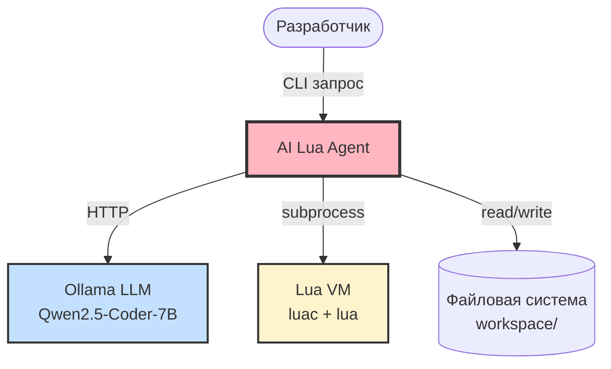
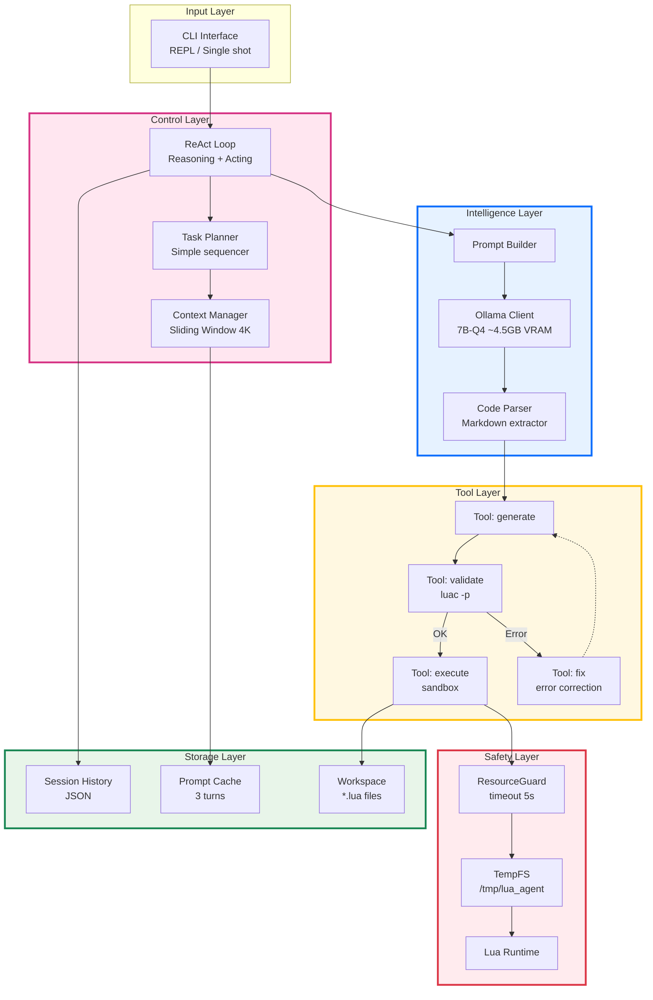
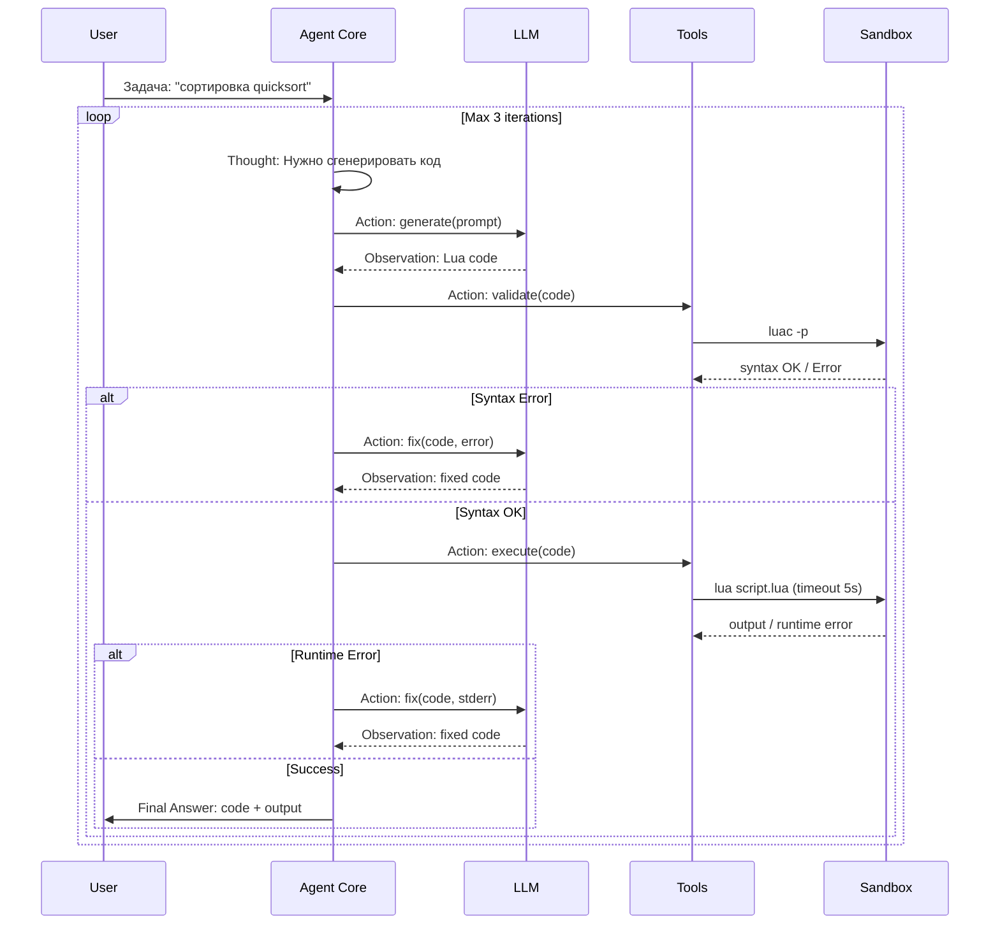

# AI Lua Agent

Локальный AI-агент для генерации и отладки Lua-кода, работающий на потребительском железе (в пределах 8GB VRAM). 
Архитектура ReAct (Reasoning + Acting) с механизмом уточнения требований и self-healing проверки синтаксиса.

## Установка и запуск модели

Для работы решения используется легковесная open-source модель, оптимизированная логикой Reasoning.

1. Установите Ollama с официального сайта.
2. Скачайте модель через Ollama (используется формат GGUF с Hugging Face):
   ```bash
   ollama run hf.co/Jackrong/Qwen3.5-4B-Claude-4.6-Opus-Reasoning-Distilled-GGUF
   ```
3. Убедитесь, что Ollama сервер запущен на `http://localhost:11434`.

## Ключевые принципы

1. **Локальность** — никаких API-ключей, работа полностью offline через Ollama
2. **Безопасность** — код выполняется в sandbox с ограничениями по времени/памяти
3. **Итеративность** — агент сам исправляет ошибки (validate → execute → fix loop)

## Архитектура

### C4 Level 1: System Context


### C4 Level 2: Container Diagram (Layers)


### Поток данных (ReAct Loop)


## Компоненты (план реализации)

| Компонент | Файл | Ответственность | Интерфейс |
|-----------|------|-----------------|-----------|
| **CLI** | `main.py` | argparse, REPL loop, команды (:save, :quit) | `run(), interactive()` |
| **Agent Core** | `agent.py` | ReAct loop, история сессий, оркестрация инструментов | `process(task) -> Result` |
| **Tool Registry** | `tools.py` | Генерация, валидация, исполнение, фикс | `generate(), validate(), execute(), fix()` |
| **Prompts** | `prompts.py` | Системные промпты, шаблоны Jinja2 | константы + format() |
| **Config** | `config.py` | Константы (VRAM, timeouts, paths) | dataclass/settings |

## Ограничения и Технические параметры (Соответствие требованиям)

- **LLM**: `hf.co/Jackrong/Qwen3.5-4B-Claude-4.6-Opus-Reasoning-Distilled-GGUF`
- **Ограничения генерации по заданию**:
  - `num_ctx` = 4096
  - `num_predict` = 256
  - `batch` = 1
  - `parallel` = 1
  Данные параметры строго передаются в API Ollama для обеспечения потребления VRAM ≤ 8.0 GB.
- **Интерактивность**: Система умеет не только генерировать код, но и задавать уточняющие вопросы на естественном языке, если задача сформулирована неполно (через CLI диалог).
- **Локальность и приватность**: Все генерации и проверки происходят локально, без обращения к сторонним API-вендорам (не используется OpenAI/Anthropic).
- **Валидация**: Реализована автоматическая синтаксическая проверка с помощью локальной `luac -p` (требует наличия Lua в системе).
